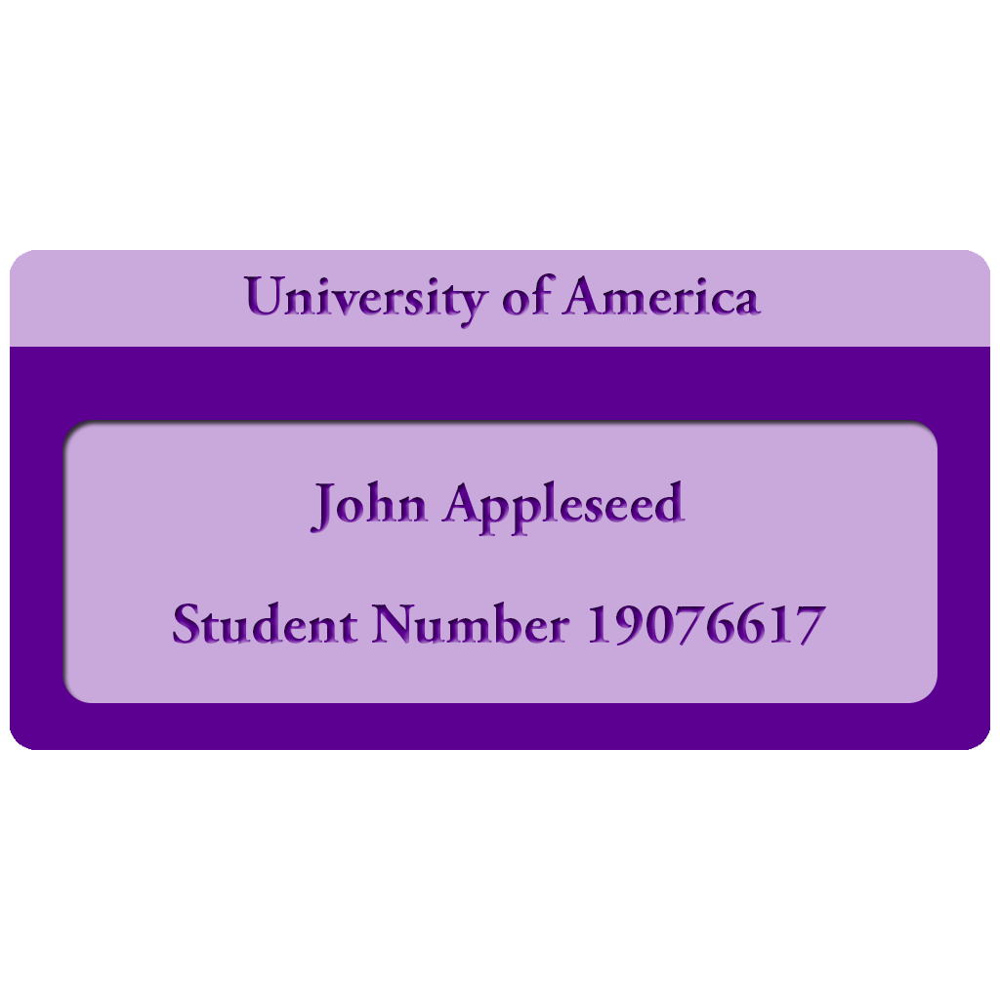
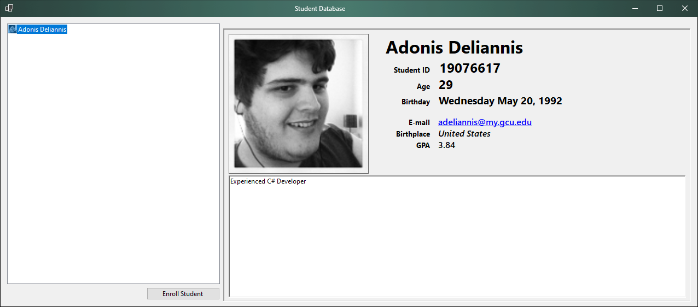

 

  

  <h3 align="center">Student Record Table</h3>

  

    An overkill project for the first activity
     
     
    <a href="https://github.com/Blizzardo1/cst150w1a1">View Demo</a>
    .
    <a href="https://github.com/Blizzardo1/cst150w1a1/issues">Report Bug</a>
    .
    <a href="https://github.com/Blizzardo1/cst150w1a1/issues">Request Feature</a>
  

     

## Table Of Contents

* [About the Project](#about-the-project)
* [Built With](#built-with)
* [Getting Started](#getting-started)
* [Usage](#usage)
* [Contributing](#contributing)
* [License](#license)
* [Authors](#authors)

## About The Project

Activity 1

The first homework assignment of CST-150: C# 1

**Install the necessary software for the course.**
*Visual Studio Enterprise installed.*

**Use the .NET environment to develop a simple graphical user interface using built-in tools**
*Student Record Viewer, sort of overkill, yet the power of .NET made it easy.*

Demonstration: https://youtu.be/k51AgWwLeVE

## Built With

Compiled with the latest installation of Visual Studio with .NET 6.0 and C# 9.0.

* [Visual Studio 2019 Enterprise](https://visualstudio.microsoft.com/vs/)
* [.NET 6.0 (preview)](https://dotnet.microsoft.com/download/dotnet/6.0)

## Getting Started

.NET 6.0 (preview) is optional, but at least .NET 5.0 is required; C# 9.0 required.

## Usage

Using this software is pretty much straight-forward. Enroll a student and enter in the required information.

#### Do Note
A Picture is required as the program will crash if no picture is specified. No checks were put in place yet and will be updated in the next commit.

## Contributing

Contributions are what make the open source community such an amazing place to be learn, inspire, and create. Any contributions you make are **greatly appreciated**.
* If you have suggestions for adding or removing projects, feel free to [open an issue](https://github.com/Blizzardo1/cst150w1a1/issues/new) to discuss it, or directly create a pull request after you edit the *README.md* file with necessary changes.
* Please make sure you check your spelling and grammar.
* Create individual PR for each suggestion.
* Please also read through the [Code Of Conduct](https://github.com/Blizzardo1/cst150w1a1/blob/main/CODE_OF_CONDUCT.md) before posting your first idea as well.

### Creating A Pull Request

1. Fork the Project
2. Create your Feature Branch (`git checkout -b feature/AmazingFeature`)
3. Commit your Changes (`git commit -m 'Add some AmazingFeature'`)
4. Push to the Branch (`git push origin feature/AmazingFeature`)
5. Open a Pull Request

## License

Distributed under the GPLv3 License. See [LICENSE](https://github.com/Blizzardo1/cst150w1a1/blob/main/LICENSE.md) for more information.

## Authors

* **Adonis Deliannis** - *Student / Developer* - [Adonis Deliannis](https://github.com/Blizzardo1) - *Created this project*
